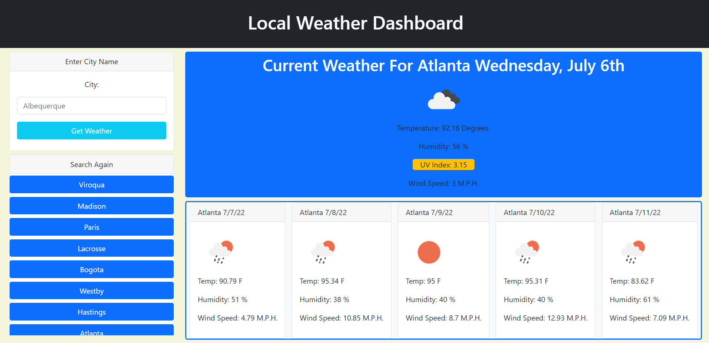

# Simple Weather Dashboard

## Purpose
Everyone wants to know what the weather is going to be. Can help with the planting of crops, not getting rained out of a beach day, or making sure you pack the appropriate amount of sunscreen on the same said beach day! This weather app should help you to better understand the weather forcast for a given city.

## Built With
* HTML
* CSS
* JavaScript
* Bootstrap
* JQuery
* MomentJS

## Application

Here's a look at the deployed webpage!

https://samvrny.github.io/simple-weather-app/

##Contribution

Made by Samuel Varney